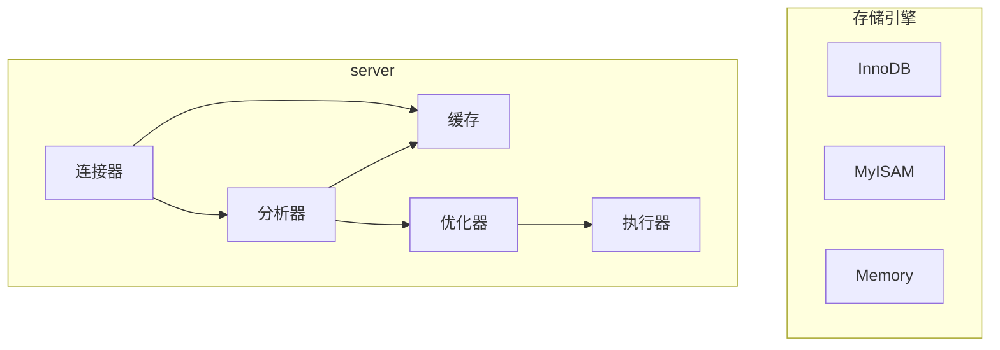

## mysql基本架构

+ Serve层

  + 连接器

    负责和客户端建立连接、获取权限、维持和管理连接

  + 缓存

    之前执行过的select语句及其结果可能会以key-value的形式存在缓存中，如果缓存中能命中，就直接返回缓存的结果。当表内容被更新(包括delete和update)，这个表关联到的所以缓存都会失效，所以不应该依赖这个机制来做优化。Mysql 8.0 以后缓存被取消。

  + 分析器

    1. 词法分析
    2. 语法分析

  + 优化器

    对需要执行的sql进行优化，例如选择哪个索引和决定连表顺序。然后会制定执行方案。

  + 执行器

    首先会检查连接是否有这些表的执行权限，然后会根据执行方案使用存储引擎的接口来执行。

    比如我们这个例子中的表 T 中，ID 字段没有索引，那么执行器的执行流程是这样的：

    1. 调用 InnoDB 引擎接口取这个表的第一行，判断 ID 值是不是 10，如果不是则跳过，如果是则将这行存在结果集中；
    2. 调用引擎接口取“下一行”，重复相同的判断逻辑，直到取到这个表的最后一行。
    3. 执行器将上述遍历过程中所有满足条件的行组成的记录集作为结果集返回给客户端。

    至此，这个语句就执行完成了。

+ 存储引擎

  负责数据的存储和提取

+ 但是全部使用长连接后，你可能会发现，有些时候 MySQL 占用内存涨得特别快，这是因
  为 MySQL 在执行过程中临时使用的内存是管理在连接对象里面的。这些资源会在连接断
  开的时候才释放。所以如果长连接累积下来，可能导致内存占用太大，被系统强行杀掉
  （OOM），从现象看就是 MySQL 异常重启了。
  怎么解决这个问题呢？你可以考虑以下两种方案。
  1. 定期断开长连接。使用一段时间，或者程序里面判断执行过一个占用内存的大查询后，
    断开连接，之后要查询再重连。
  2. 如果你用的是 MySQL 5.7 或更新版本，可以在每次执行一个比较大的操作后，通过执行
    mysql_reset_connection 来重新初始化连接资源。这个过程不需要重连和重新做权限验
    证，但是会将连接恢复到刚刚创建完时的状态。