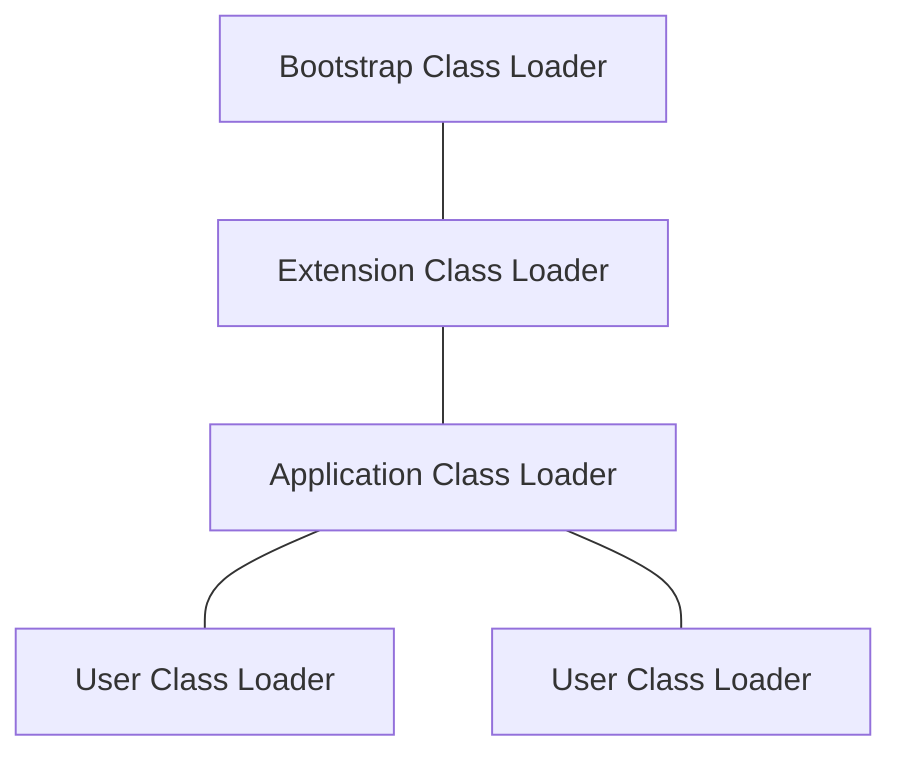

## 类加载流程

1. 加载(Loading)

   虚拟机规范中，对什么时候进行加载，并没有强制约束。

   加载阶段需要完成的事情：

   1. 通过一个类的全限定名来获取定义此类的二进制字节流
   2. 将这个字节流所代表的静态存储结构转化为方法区的运行时数据结构
   3. 在内存中生产一个代表这个类的java.lan.Class对象，作为方法区这个类的各种数据的访问入口

2. 验证(Verification)

   大致要完成4个阶段的验证动作：

   1. 文件格式验证

      对加载进来的字节流进行文件格式上面的验证，例如，魔数是否正确，大小版本是否支持，各个索引是否有不合理的指向。这个阶段的验证，本质上就是验证字节流里面的内容，是否能够正常的被加载到方法区当中。这个验证如果通过，对应的内容就回被加载到方法区，后面的验证都会基于方法区里的数据而非字节流。

   2. 元数据验证

      对字节码的信息进行语义上面的校验，例如是否存在父类、这个类的是否继承了不允许继承的父类等。

   3. 字节码验证

      这个阶段，主要是对方法体进行数据流和控制流分析，验证程序的逻辑是否正常、是否有不安全操作。

   4. 符号引用验证（symbolic references）

      符号引用验证是发生在解析之前，是保证符号引用能够正确的转换称为直接引用。

3. 准备(Preparation)

   这个阶段会为类中定义的变量（static修饰的变量）分配内存空间并且设置初始值。

   对于

   ```java
   public static int value = 123;
   ```

   这样的情况，初始值是被设置为0，因为cinit方法是还没执行的。

   对于

   ```java
   public static final int value = 123;
   ```

   这样的情况的，会被设置为123，因为这个是ConstantValue，在编译期已经能确定值。

4. 解析(Resolution)

   在这个阶段，各种对于常量池里面的符号引用(symbolic references)转化为直接应用(direct references)

5. 初始化(Initialization)

   虚拟机规范中规定了有且仅有这六种情况会触发初始化。这六种情况，被称为主动引用，其余的引用叫被动引用。

   初始化阶段本质就是执行编译器产生的类初始化方法clinit。clinit方法，包含了类变量(static变量)已经静态代码块，顺序和java文件中的顺序一致。

   虚拟机在执行子类的clinit方法的时候，会保证父类的clinit方法已经被调用，所以父类的类变量初始化已经静态代码段的执行，都会在子类之前。

   对于接口来说，执行接口的clinit方法，是不需要执行父接口的clinit方法的，而且接口的实现类初始化的时候，也不会执行实现接口的clinit方法。

6. 使用(Using)

7. 卸载(Unloading)

## 双亲委派模式(parents delegation model)以及三层类加载器

一般现在的虚拟机都是使用三层类加载器和双亲委派模式来实现类加载。

三层类加载器分别是

1. 启动类加载器(Bootstrap Class Loader)

   加载<JAVA_HOME>/lib目录下的jar包。由c++实现

2. 扩展类加载器(Extension Class Loader)

   加载<JAVA_HOME>/lib/ext下的jar包。

3. 应用程序类加载器(Application Class Loader)

   加载项目ClassPath下的类库。

三层类加载的关系如下图



双亲委派机制，就是当一个类加载器需要加载一个类的时候，首先会委托父加载器来进行加载，如果父加载器反馈无法加载的时候，才会尝试去加载。这样能保证这个别加载进来的类是唯一的。

